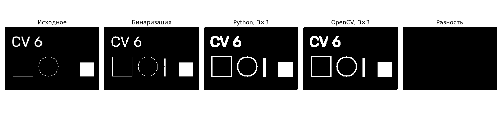
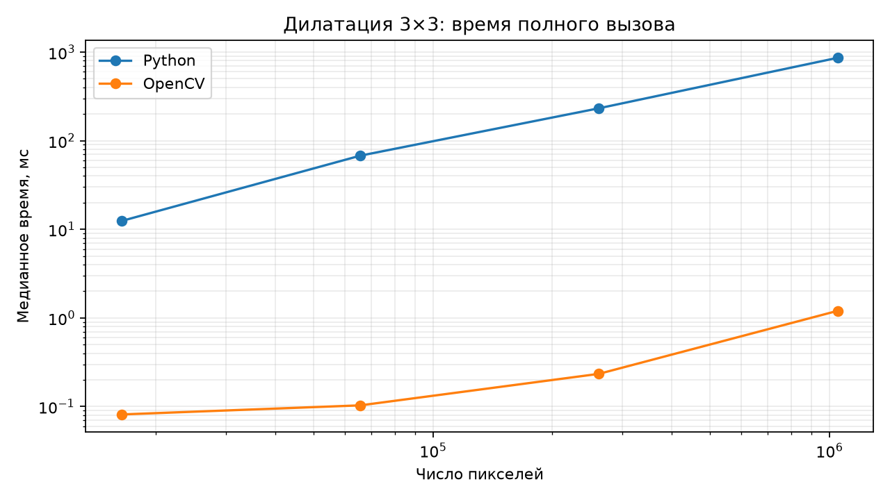

# Лабораторная работа №1. Вариант 6: дилатация 3×3

**Цель:** реализовать простую операцию обработки изображений и сравнить собственную
реализацию на Python с библиотечной функцией OpenCV.

**Задание:** дилатация с примитивом размера 3×3. Бинаризация выполнена средствами
OpenCV, как допускается в [условии](LW1.md).

## 1. Теоретическая база

Дилатация — это морфологическая операция, которая расширяет светлые области на бинарном или черно-белом изображении. Здесь объект
представлен белыми пикселями со значением 255, фон — чёрными со значением 0.
Структурный элемент — квадрат с центральным якорем:

```text
1 1 1
1 1 1
1 1 1
```

Для каждого пикселя вычисляется максимум в окне 3×3:

$$
D(y,x)=\max_{i,j\in\{-1,0,1\}} I(y+i,x+j).
$$

Если хотя бы один пиксель окна белый, выходной пиксель становится белым.
Выполняется одна итерация. За границами изображения принимается значение 0;
размер результата совпадает с размером входа. Такое правило утолщает линии,
соединяет близкие фрагменты и заполняет небольшие отверстия. Поскольку элемент
содержит центр, исходные белые пиксели сохраняются.
[Источник: морфологические операции OpenCV](https://docs.opencv.org/4.x/d9/d61/tutorial_py_morphological_ops.html).

Перед дилатацией полутоновое изображение бинаризуется:

$$
B(y,x)=\begin{cases}255,& I(y,x)>T,\\0,& I(y,x)\le T.\end{cases}
$$

По умолчанию `T = 127`. Для тёмных объектов на светлом фоне предусмотрена инверсия
маски (`INVERT = True` в `main.py`). Равенство порогу относится к чёрному фону при обычной
бинаризации. [Источник: пороговая обработка OpenCV](https://docs.opencv.org/4.x/d7/d4d/tutorial_py_thresholding.html).

## 2. Описание разработанной системы

Программа работает из командной строки, сохраняет результаты и не требует
графического интерфейса. Изображение и параметры бинаризации задаются переменными
в начале `main.py`: `INPUT_PATH`, `THRESHOLD` и `INVERT`. При `INPUT_PATH = None`
используется авторский синтетический пример с тонкими линиями, разрывами,
отверстием и пикселями в углах.

Библиотечная версия вызывает `cv2.dilate` с квадратным ядром из единиц,
`anchor=(1, 1)`, `iterations=1`, `BORDER_CONSTANT` и `borderValue=0`.
Собственная версия преобразует маску в списки Python, добавляет нулевую рамку и
обычными вложенными циклами находит максимум девяти соседних значений. NumPy
используется для проверки входа и преобразования формата, сама дилатация не
использует библиотечные операции максимумов, свёртки или морфологии.

Обе функции принимают непустую двумерную маску `uint8` со значениями 0/255,
возвращают новый массив и сохраняют исходное изображение. Сложность собственного
алгоритма — `O(HW)` по времени и `O(HW)` по дополнительной памяти.

### Установка и запуск

Нужны Python 3.12 или новее и менеджер `uv`. Команды выполняются из корня проекта.
Зависимости объявлены в [pyproject.toml](../pyproject.toml), точные версии закреплены
в [uv.lock](../uv.lock).

```powershell
uv sync --frozen

# Запуск
uv run --frozen python lab1/main.py
```

По умолчанию результаты сохраняются в `lab1/results`: `input.png`, `binary.png`,
`native.png`, `opencv.png`, `difference.png`, `comparison.png` и `processing.json`.

## 3. Результаты работы и тестирования

### Обработка изображения



На примере размером 240×160 тонкие контуры утолщились, две близкие вертикальные
линии соединились, одиночное отверстие в заполненном прямоугольнике исчезло.
Число белых пикселей увеличилось с **2327 до 3919**. Результаты Python и OpenCV
совпали: **0 различающихся пикселей**, изображение разности полностью чёрное.
Исходные численные данные сохранены в [processing.json](results/processing.json).

### Сравнение быстродействия

Измерения выполнены в окружении: **Python 3.12.15, OpenCV 5.0.0, NumPy 2.5.3,
Matplotlib 3.11.2**, Windows 11. Для серии измерений OpenCV
использовал один поток.

Для каждого размера сгенерирована бинарная маска с вероятностью белого пикселя
0,2 и фиксированным `seed=6`. Для каждой реализации выполнено по **7 повторений**. В таблице — медианы времени полного вызова функции.
Использован счётчик
[`perf_counter_ns`](https://docs.python.org/3/library/time.html#time.perf_counter_ns).

В измерение входят проверка маски, выделение памяти, вычисление дилатации и
преобразование списков в собственной версии. Чтение, бинаризация, сравнение
выходов, запись файлов и построение графиков выполняются вне измерения.
Таким образом, сравнивается время используемых программой функций, включая
их накладные расходы.

| Размер | Пикселей | Python, мс | OpenCV, мс | Ускорение OpenCV | Совпадение |
|---|---:|---:|---:|---:|---|
| 128×128 | 16 384 | 12,4303 | 0,0814 | 152,7× | Полное |
| 256×256 | 65 536 | 67,8285 | 0,1031 | 657,9× | Полное |
| 512×512 | 262 144 | 232,4713 | 0,2338 | 994,3× | Полное |
| 1024×1024 | 1 048 576 | 862,4753 | 1,2017 | 717,7× | Полное |



Обе оси графика логарифмические. Подробные измерения каждого повторения и
сведения об окружении находятся в [benchmark.json](results/benchmark.json).

Время собственной реализации растёт с числом пикселей: каждому пикселю
соответствуют девять проверок в интерпретаторе Python. OpenCV выполняет обработку
в скомпилированном коде и во всех измеренных случаях быстрее. Ускорение не
постоянно: на него влияют размер массива, выделение памяти, накладные расходы
проверки и состояние системы. Значения относятся к этому запуску и могут
измениться на другом компьютере или при другой нагрузке.

## 4. Выводы по работе

Реализована одна итерация бинарной дилатации с квадратным элементом 3×3 двумя
способами. Явное задание нулевой границы и центрального якоря обеспечивает
одинаковую обработку краёв. Тесты и демонстрация подтвердили совпадение выходов.

Собственная реализация позволяет проследить алгоритм и его линейную сложность.
Для практической обработки изображений эффективнее библиотечная реализация:
в выполненной серии её полные вызовы быстрее примерно в 153–994 раза.
Дилатация расширяет также отдельные белые шумовые пиксели и может соединять
соседние объекты, поэтому выбор порога и полярности маски влияет на результат.

## 5. Использованные источники

1. [Условие лабораторной работы](LW1.md).
2. [OpenCV: Morphological Transformations](https://docs.opencv.org/4.x/d9/d61/tutorial_py_morphological_ops.html) — определение дилатации и структурных элементов.
3. [OpenCV: Image Thresholding](https://docs.opencv.org/4.x/d7/d4d/tutorial_py_thresholding.html) — бинаризация и инверсия маски.
4. [Python: time.perf_counter_ns](https://docs.python.org/3/library/time.html#time.perf_counter_ns) — измерение длительности выполнения.
